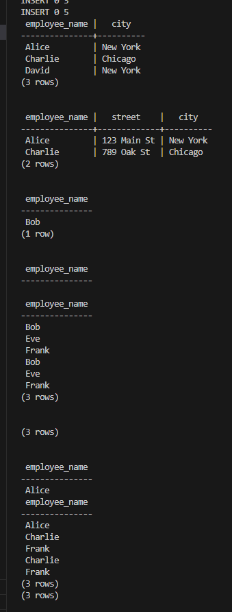

# DSC-E3.9

employee (employee_name, street, city)
works (employee_name, company_name, salary)
company (company_name, city)
manages (employee_name, manager_name)

3.9 Consider the employee database of Figure 3.20, where the primary keys are underlined. Give an expression in SQL for each of the following queries:
a. Find the names and cities of residence of all employees who work for 'First Bank Corporation'.

b. Find the names, street addresses, and cities of residence of all employees who work for 'First Bank Corporation' and earn more than $10,000.

c. Find all employees in the database who live in the same city as the company 'Small Bank Corporation'.

d. Find all employees in the database who do not work for 'First Bank Corporation'.

e. Assume that the companies may be located in several cities. Find all employees who earn more than each employee of 'Small Bank Corporation'.

f. Find the company that has the most employees.

g. Find those companies whose employees earn a higher salary, on average, than the average salary at 'First Bank Corporation'.

